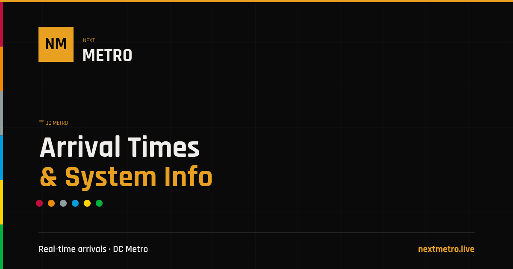

<div align="center">



# NextMetro

**Real-time arrival tracker for the Washington D.C. Metrorail system.**

Live train predictions, service alerts, elevator/escalator status, fare calculator, and station info for all 98 WMATA stations — built as a fast, zero-framework static site on Cloudflare Workers.

[](https://nextmetro.live)
[](https://workers.cloudflare.com/)
[](#license)

</div>

---

## What It Does

NextMetro is an independent, real-time dashboard for the D.C. Metro system. It pulls live data from the [WMATA API](https://developer.wmata.com/) and presents it through a design language inspired by the Metro's own architecture — concrete vaults, PIDS boards, pylon signage.

### Pages & Features

| Page | What It Shows |
|------|--------------|
| **[Station Pages](https://nextmetro.live/station/metro-center/)** | PIDS arrival board, system status, service alerts, elevator/escalator status, fare calculator. Transfer stations (Metro Center, Gallery Place) show dual side-by-side boards — one per physical platform. |
| **[Line Pages](https://nextmetro.live/lines/red/)** | All stations on the line with transfer/parking badges, real-time status, service hours, frequency info, and FAQ. All 6 lines covered. |
| **[Service Alerts](https://nextmetro.live/alerts/)** | Every active WMATA rail incident + elevator/escalator outage, severity-sorted, auto-refreshing. |
| **[Elevator & Escalator Status](https://nextmetro.live/elevators/)** | System-wide outage tracker grouped by station, filterable by type and line. |
| **[Fare Calculator](https://nextmetro.live/fares/)** | Peak/off-peak/senior pricing between any two stations with travel time estimates and commute cost projections. |
| **[Hours & Schedules](https://nextmetro.live/hours/)** | Operating hours, frequency tables, holiday schedules. |
| **[Homepage](https://nextmetro.live/)** | Station search, live alert preview, quick links. |

### Technical Highlights

- **Zero build step** — Vanilla HTML, CSS, and JavaScript. No framework, no bundler, no node_modules on the frontend.
- **Cloudflare Workers** — API proxy with tiered caching. Static assets served at the edge.
- **WCAG AA accessible** — Skip links, ARIA labels, keyboard navigation, contrast-compliant color system.
- **SEO-optimized** — Schema.org structured data (TrainStation, FAQPage, BreadcrumbList, SpecialAnnouncement), OG images for every page and all 98 stations, canonical URLs, sitemap.
- **25-second polling** — Arrival predictions auto-refresh. Incidents refresh every 30–60 seconds.

---

## Tech Stack

| Layer | Technology |
|-------|-----------|
| **Frontend** | Vanilla HTML5, CSS, JavaScript |
| **Backend** | Cloudflare Workers (API proxy + caching) |
| **Data Source** | [WMATA Real-Time Rail API](https://developer.wmata.com/) |
| **Typography** | [Rajdhani](https://fonts.google.com/specimen/Rajdhani) (Google Fonts) |
| **Hosting** | Cloudflare (Workers + static assets at the edge) |

---

## Design System

The visual identity — **Neutral Brutalist** — draws from the architectural language of the D.C. Metro:

- **Dark surface palette** — `#0A0A0A` background, `#141414` cards, `#1E1E1E` elevated surfaces
- **Amber accent** — `#D4A03C` for interactive elements, inspired by WMATA signage
- **PIDS display** — Black screen with brightened WMATA line colors and monospace-style data
- **Zero border-radius** — Sharp rectangular edges throughout, matching pylon sign geometry
- **WCAG AA contrast** — Every text/background combination meets accessibility standards
- **Typography** — Rajdhani across all UI, uppercase station names, tabular arrival data

### WMATA Line Colors

```
Red    #D41140  ████  |  Orange  #F09500  ████
Blue   #00A8E8  ████  |  Green   #00BD45  ████
Yellow #FFD400  ████  |  Silver  #9BA5A5  ████
```

---

## Project Timeline

This project has been built iteratively from a React prototype to a production-grade Cloudflare Workers site over ~9 months.

| Date | Milestone | Details |
|------|-----------|---------|
| **Jun 2025** | **v1.0 — Initial prototype** | React + Vite + Material UI scaffold. Station dropdown, mock train cards, design exploration. |
| **Jun 2025** | **v2.0 — Full WMATA integration** | Rewrote from React to vanilla HTML/CSS/JS. Express backend proxy, real-time arrivals, fare calculator, system status. Deployed on Netlify + Render. |
| **Feb 2026** | **Cloudflare migration** | Moved entire stack to Cloudflare Workers. Single deployment for API proxy + static assets. Eliminated cold starts. |
| **Feb 2026** | **v2.1 — Line pages** | 6 dedicated line pages with station lists, transfer badges, parking indicators, service info, and FAQ sections. |
| **Feb 2026** | **v2.2 — Alerts page** | Unified rail incidents + elevator/escalator outages. Severity sorting, SpecialAnnouncement schema. |
| **Feb 2026** | **v2.3 — Elevator status** | Station-grouped outage view with dual filter system. Accessibility-first sorting (elevator outages surface first). |
| **Mar 2026** | **v2.5 — Site-wide audit** | WCAG compliance pass, skip navigation on all pages, Schema.org structured data everywhere, meta/OG tags audit, static status bar. |
| **Mar 2026** | **v2.6 — Station pages** | 5 dedicated station pages including dual-PIDS transfer stations (Metro Center, Gallery Place). Search navigation. |
| **Mar 2026** | **v2.7 — Performance** | CSS code splitting (5,700-line monolith → 433 core + 11 page-specific files). JS DRY refactor (shared.js eliminates ~680 lines of duplication across 6 files). Comprehensive site audit + IndexNow integration. |

---

## Contributing

Contributions are welcome. If you're interested in helping improve NextMetro:

1. **Open an issue first** — Describe what you want to change and why. This prevents duplicate work and ensures alignment.
2. **Fork and branch** — Create a feature branch from `main`.
3. **Keep it focused** — One feature or fix per PR. Small PRs are easier to review.
4. **Test locally** — Make sure the site works before submitting. See [Local Development](#local-development) below.
5. **Submit a PR** — Reference the issue number in your PR description.

### What Would Be Helpful

- Additional station pages (only 5 of 98 stations have dedicated pages so far)
- Mobile UX improvements
- Performance optimizations
- Accessibility improvements
- Bug reports from real Metro riders

### Local Development

**Prerequisites:** Node.js v18+, a [WMATA Developer API key](https://developer.wmata.com/)

```bash
git clone https://github.com/nick-poole/nextmetro.git
cd nextmetro
npm install
```

Set your WMATA API key as a Cloudflare Workers secret:

```bash
npx wrangler secret put WMATA_API_KEY
```

Start the local dev server:

```bash
npm start
```

---

## Security

Security details are documented in [SECURITY.md](SECURITY.md).

If you discover a vulnerability, **do not** open a public issue. Please email [contact@nextmetro.live](mailto:contact@nextmetro.live) directly.

---

## License

**Source Available — Not Open Source**

Copyright (c) 2025–2026 Nick Poole. All rights reserved.

The source code of this project is made available for **viewing and educational purposes only**. You may:

- Read, study, and learn from the code
- Submit contributions (pull requests) to this repository
- Reference the code in blog posts or educational materials with attribution

You may **not**:

- Deploy, host, or run any copy of this project (in whole or in part)
- Use the code, design, or assets in your own projects
- Redistribute, sublicense, or sell the code or any derivative work
- Remove or alter copyright notices

Contributions submitted via pull request are licensed to the project under the same terms.

For questions about usage or licensing, contact [contact@nextmetro.live](mailto:contact@nextmetro.live).

---

## Disclaimer

NextMetro is an independent project. It is not affiliated with, endorsed by, or connected to the Washington Metropolitan Area Transit Authority (WMATA). All transit data is sourced from the [WMATA Developer API](https://developer.wmata.com/).
